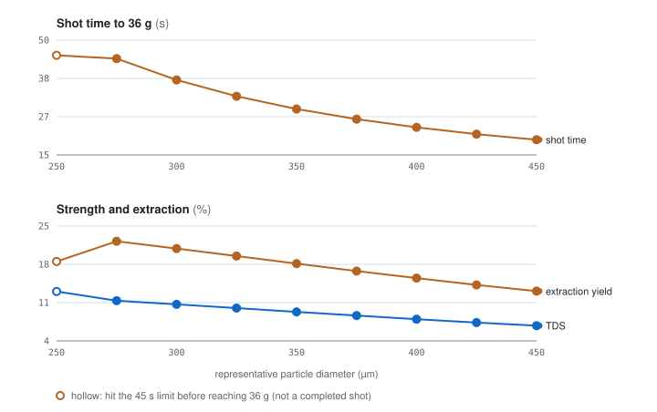
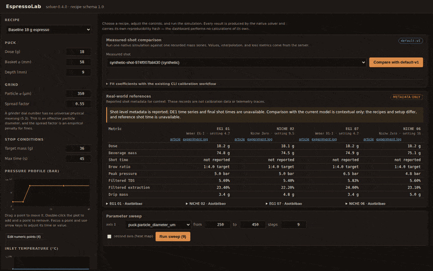
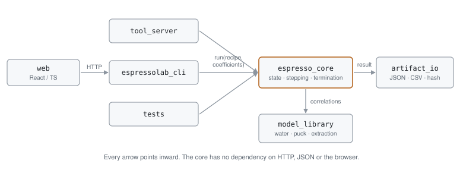

# EspressoLab

A local engineering workbench that simulates an espresso shot from controllable
brew inputs, plots pressure, temperature, flow, beverage mass, strength and
extraction over time, and compares simulations with reproducible sweeps or
stored measured-shot telemetry.

Deterministic C++20 simulation core, React/TypeScript dashboard, interactive
terminal UI, no AI, and separate experimental 2D and Cartesian 3D CFD solvers.

**Live dashboard:** [espressolab-dashboard.fly.dev](https://espressolab-dashboard.fly.dev/)
— the real native solver behind a hosted container (see `Dockerfile`), not a
static demo; every control runs the same C++ core as the local build.

## Quick start

```bash
./scripts/build.sh          # cmake + build (dependencies are vendored)
./scripts/demo.sh           # baseline shot, grind sweep, determinism check
./scripts/dev.sh            # tool server + dashboard on http://localhost:5173
```

A baseline shot on an M-series laptop:

```
  termination     target_mass_reached
  shot time       29.03 s
  beverage mass   36.01 g
  brew ratio      1:2.00
  average flow    1.42 ml/s
  peak flow       2.72 ml/s
  TDS             9.09 %
  extraction      18.18 %
  mass residuals  water -4.86e-17 kg, solids 2.17e-18 kg
  clamps          0
  result hash     80156b2ee1185e238f73145c5080cc4e89cdec2f26a82b30a2778362c4243c06
```

`espressolab_cli bench` runs a 60-second shot at 100 Hz in **0.49 ms** median —
about 2000 simulations per second, and 40x inside the 20 ms budget.

## What a grind sweep looks like

<picture>
  <source media="(prefers-color-scheme: dark)" srcset="docs/images/grind-sweep-dark.svg">
  
</picture>

`./build/apps/espressolab_cli/espressolab_cli sweep --spec assets/sweeps/grind-size.json`

| particle ⌀ (µm) | shot time (s) | TDS (%) | yield (%) | stop |
| --- | --- | --- | --- | --- |
| 250 | 45.00 | 12.92 | 18.58 | time limit reached |
| 300 | 37.66 | 10.51 | 21.02 | target mass reached |
| 350 | 29.03 | 9.09 | 18.18 | target mass reached |
| 400 | 23.57 | 7.72 | 15.45 | target mass reached |
| 450 | 19.88 | 6.49 | 12.99 | target mass reached |

Finer grind, more resistance, longer shot, stronger and more extracted — until
250 µm chokes badly enough to hit the time limit before reaching 36 g.

## The dashboard



*Baseline shot run to completion, then a 1600-point grind x temperature sweep (`puck.particle_diameter_um` x `temperature_profile_c.constant`, 40 steps each) rendered as a heat map — captured against `./scripts/dev.sh` at commit `4f6e51c`, not staged or narrated.*

The workbench separates Shot, Measured Data, References, and Sweeps into
keyboard-accessible tabs while preserving each workflow's state. Recipes are
edited through draggable pressure and inlet-temperature curves with a numeric
point list underneath. On narrow screens the recipe editor collapses so an
existing result stays immediately accessible.

Shot signals share one selectable analysis timeline and event lane, with an
expandable raw-data table. Sweeps run in the background with live progress and
a cancel button — a 1600-run grind x temperature grid finishes in about four
seconds and renders as a keyboard-inspectable heat map.

A cross-section panel replays the shot beside the charts: water entering the
bed, the saturation level rising while nothing reaches the cup, then the stream
leaving the spout and the cup filling and darkening as TDS climbs. Lateral
regions are drawn to scale by area fraction, so a channelled puck shows its
narrow high-permeability region taking most of the flow. The panel plays on its
own transport or follows the shared chart cursor.

The dashboard also includes a read-only catalogue of real-world reference shots
under `espresso_real_world_refs/`. It preserves the reported setup and terminal
measurements, links back to the source experiment, and clearly marks the records
as metadata only: the supplied files contain no DE1 time series or final shot
times and are not used for calibration or validation.

A separate measured-shot catalogue reads model-ready files from
`assets/measured_shots/`. Selecting one runs the native solver once with the
shot's recorded recipe and overlays simulated and measured mass. It reports
mass, pressure, stop-time, and TDS residual metrics where measurements exist; it
does not fit coefficients. The repository's current measured shots are
synthetic fixtures, so this workflow verifies comparison plumbing rather than
real-world accuracy.

Every simulation number on screen comes from the native solver. The one piece of browser
arithmetic is the cross-section's spout, which differences beverage mass between
neighbouring samples to know how fast the cup is filling — the sampled flow is
the Darcy flow *into* the bed, which is a different number until the pores are
full.

## Architecture

<picture>
  <source media="(prefers-color-scheme: dark)" srcset="docs/images/architecture-dark.svg">
  
</picture>

```
web (React/TS)  ->  tool_server (REST)  ->  experiment_runner
                                         ->  artifact_io (JSON/CSV/hashes)
                                         ->  reference_io (published metadata)
                                                     |
                                         espresso_core (state, stepping, termination)
                                                     |
                                         model_library (water, permeability, heat, extraction)

CLI and CFD tests  ->  cfd / cfd3d (separate Level 4 solvers)
                                      -> espresso_core + model_library

espressolab_cli grind  ->  grind (separate comminution model)
                                      -> espressolab_core_types only
```

Dependencies point inward. The simulation library knows nothing about HTTP,
React, plotting or filesystem locations, so the same model runs unchanged in
unit tests, the CLI, headless sweeps and the browser. The dashboard performs no
authoritative calculations — it posts a recipe and renders what comes back.

See [docs/architecture.md](docs/architecture.md).

## Model assumptions and limitations

A lateral parallel-region puck divided into stacked axial finite-volume cells:
Darcy flow through a Kozeny-Carman-shaped permeability with the cells in
hydraulic series, a bounded empirical compression curve, and cell-local thermal
and extraction states. `axial_cells` defaults to 1, which is the lumped puck.
Every equation is in [docs/model.md](docs/model.md).

What it does **not** do:

- The default pipeline has no radial structure inside a region and no dynamic
  channelling. Separate 2D axisymmetric and Cartesian 3D CFD solvers add spatial
  structure; they do not alter the default shot pipeline or its artifacts.
- **No pore-resolved simulation.** The CFD solver's momentum closure is Darcy at
  the representative-elementary-volume scale. Pore geometry is not meshed, so
  nothing here is particle-resolved or a pore-scale DNS.
- **Nothing is validated against a real shot**, CFD included. Verification and
  validation are different claims; see below.
- No mapping from a grinder dial number to particle size. Grind is a physical
  input in micrometres. A recipe may instead carry a particle size distribution
  (`puck.grind`), from which the solver derives d32 and the spread and extracts
  each size class at its own rate; `espressolab_cli grind` generates one from
  burr geometry, but it too takes a physical gap in microns, not a dial number,
  and sits outside the shot pipeline. Nothing here has been checked against a
  measured grind.
- **Flavour is a heuristic overlay, not a prediction.** Estimated TDS and
  extraction yield are engineering outputs. A recipe may carry a bean profile,
  and the solver then partitions the solids it already extracted across six
  authored solute classes to report sensory axes and a match score against the
  bean's declared target. Every number in a bean document is an authored prior:
  none is measured, and no predicted axis has been compared with a tasting
  panel. It changes no mass, TDS, yield or hash, and it is not a calibration
  target. Water chemistry, distribution and sensory context remain unresolved.
- **The default coefficients are uncalibrated.** They put the baseline recipe in
  a plausible range; no measured shot has been fitted. The calibration machinery
  is built and tested — `espressolab_cli calibrate` fits a named set of
  physically interpretable coefficients against measured shots, with held-out or
  leave-one-shot-out validation — but it has only ever been run against synthetic data. See
  [docs/calibration.md](docs/calibration.md).

## The CFD solver

`espressolab_cli cfd` runs a two-dimensional axisymmetric finite-volume solver
for two-phase flow through the puck: an elliptic pressure solve for
`div(lambda_t grad p) = 0` on an (r, z) mesh, with IMPES saturation transport
and donor-upwinded enthalpy and solute advection. It is a separate entry point.
The Level 1-3 pipeline, its artifacts and its hashes are unaffected by it.

```bash
espressolab_cli cfd --recipe assets/recipes/channelled.json \
  --radial 10 --axial 16 --field saturation
```

It reports its own verification with every run:

```
  max |div u_t|   1.250e-07 1/s
  water residual  -2.776e-17 kg
  solids residual -4.770e-18 kg
  saturation clamps 0
```

Because the mesh carries a radial coordinate, a channelled recipe is no longer
*told* how the flow splits: the solver is given only where the permeability
differs and resolves the radial pressure gradient and cross-flow itself.

The momentum closure is Darcy at the representative-elementary-volume scale,
which is what CFD means for a medium whose pores are represented statistically.
It is not a pore-resolved simulation, and it is verified but not validated. See
[docs/model.md](docs/model.md).

`espressolab_cli cfd3d` is the separate Cartesian path. It accepts a recipe or
a complete 3D case, bounded `nx`/`ny`/`nz` dimensions, optional material field,
and snapshot controls. File runs write `case.json`, `summary.json`,
`manifest.json`, `samples.csv`, `mesh.json`, `fields.elf3d`, and `index.json`;
the case/result JSON schemas and `ELF3D-1` field format are versioned separately
from standard shot artifacts.

## Reproducibility

Every run records its recipe hash, coefficient hash, solver version, step size
and a SHA-256 result hash over the canonicalised inputs and ordered output
samples. The same inputs produce the same hash on the same build; the final
floating-point ulp can vary between platform math libraries, so the result hash
is not a universal cross-platform checksum. `scripts/demo.sh` checks the
same-build property.
Coefficient sets are versioned separately from recipes and from solver code, so
a re-fit never silently changes what a past run meant.

## Command line

```bash
espressolab_cli simulate --recipe <file> [--coefficients <file>] [--out <dir>]
                         [--dt <s>] [--sample-interval <s>] [--quiet]
espressolab_cli sweep    --spec <file> [--out <dir>] [--quiet]
                         [--workers <n>] [--ring-capacity <n>]
espressolab_cli calibrate --shots <dir> --fit <name,...> [--holdout <id,...>]
                           [--coefficients <file>] [--out <file>] [--report <file>]
                           [--leave-one-out]
espressolab_cli synthesize --recipe <file> [--noise <g>] --out <file>
espressolab_cli cfd      --recipe <file> [--coefficients <file>]
                         [--radial <n>] [--axial <n>] [--dt <s>]
                         [--field pressure|saturation|temperature|tds]
espressolab_cli cfd3d    --recipe <file> [--coefficients <file>] [--out <dir>]
                         [--nx <n>] [--ny <n>] [--nz <n>] [--dt <s>]
                         [--sample-interval <s>] [--snapshot-interval <s>]
                         [--material <file>] [--quiet]
espressolab_cli cfd3d    --case <file> [--out <dir>] [--quiet]
espressolab_cli grind    [--spec <file>] [--out <dir>]
espressolab_cli bench    [--seconds <s>] [--repeats <n>]

espressolab_cli params     # sweepable recipe parameters
espressolab_cli fit-params # fittable coefficients, with bounds
espressolab_cli version
espressolab_cli tui        # interactive terminal UI (POSIX TTY only)
```

`sweep --workers <n>` opts into the parallel batch runner; leaving it unset keeps
the sequential path. It produces the same runs, in the same order, with the
same per-run result hashes either way. `--workers` and `--ring-capacity` change
wall time, never the answer. The separate `grind` command writes a recipe-ready
particle distribution without becoming part of the shot pipeline.

`espressolab_cli tui` is a guided, form-based frontend to every command above,
for interactive macOS/Linux terminals. It calls the same native loaders,
solvers, calibration APIs, and artifact writers directly -- not the CLI, not
the REST server -- so it produces the same units, artifacts, and result
hashes as the commands above for the same inputs. Long-running work runs off
the render loop with cooperative cancellation (`c` or Ctrl-C); a cancelled
single run never writes a partial artifact, and a cancelled sweep keeps the
runs it already completed. See [getting-started.md](docs/getting-started.md)
for a walkthrough.

Artifacts land in the layout of section 10.4:

```
outputs/shots/<run-id>/{recipe,coefficients,summary,manifest}.json + samples.csv
outputs/sweeps/<sweep-id>/{sweep.json,runs.jsonl,aggregate.csv,manifest.json}
<cfd3d-out-dir>/{case,summary,manifest,mesh,index}.json + samples.csv + fields.elf3d
<grind-out-dir>/grind.json + recipe-grind.json   (no hashes; not a shot artifact)
```

## Tests

```bash
./scripts/test.sh
```

The current native suite passes 226 test cases and 86,773 assertions: unit tests
for every correlation, whole-shot
integration tests, generated-input property tests, mass-balance invariants, a
step-size convergence test, sweep progress and cancellation tests, parallel-region
balance and serialization tests, axial grid-refinement and wetting-front tests, CFD verification tests
(divergence, exact solutions, mesh convergence, conservation),
calibration recovery tests, deterministic leave-one-out validation tests,
particle-size distribution, grinder comminution, bean-profile and flavour-overlay tests,
native cancellation-checkpoint tests, measured-shot catalogue/comparison tests,
and pure (terminal-free) tests of the
TUI's navigation, forms, and shared workflow services. A separate POSIX PTY
smoke script (`python3 tests/pty/tui_smoke.py`) defines 15 checks for the TUI's
actual terminal rendering, form execution/scrolling, resize, Ctrl-C, restoration,
and non-TTY rejection; it is not part of `./scripts/test.sh` and passes locally.
The web suite passes 222 Vitest tests with coverage thresholds and 26 Chromium
desktop/mobile Playwright tests against the native server. Hosted GitHub Actions
passed the macOS, Linux, dashboard, and full nightly browser matrix for current
`origin/main` at [`347177c`](https://github.com/Supersmasher149/CoffeeSim/commit/347177c)
in [run 33508004359](https://github.com/Supersmasher149/CoffeeSim/actions/runs/33508004359).
See [docs/testing.md](docs/testing.md).

## Documentation

| Document | Contents |
| --- | --- |
| [docs/getting-started.md](docs/getting-started.md) | Build, test, simulate, run the dashboard, and locate artifacts |
| [docs/development.md](docs/development.md) | Contributor workflow, module ownership, build variants, and quality checks |
| [docs/data-contracts.md](docs/data-contracts.md) | Recipe, coefficient, result, sweep, measured-shot, CFD3D, and reference data ownership |
| [docs/model.md](docs/model.md) | Every equation, coefficient and guardrail |
| [docs/architecture.md](docs/architecture.md) | Component boundaries and the dependency rule |
| [docs/api.md](docs/api.md) | REST endpoints and the error contract |
| [docs/calibration.md](docs/calibration.md) | Fitting coefficients to measured shots |
| [docs/testing.md](docs/testing.md) | What each test layer is for |
| [docs/roadmap.md](docs/roadmap.md) | Status against the four-week plan, and what is not done |
| [docs/current-state-and-gaps.md](docs/current-state-and-gaps.md) | Evidence-based implementation status and open gaps |
| [schemas/](schemas/) | JSON Schema for recipes, coefficients, shot results, and CFD3D cases/results |

## Requirements

CMake 3.20+, a C++20 compiler, and Node 20+ for the dashboard. nlohmann/json,
Catch2, cpp-httplib, and FTXUI (the CLI's terminal UI, linked only by
`espressolab_cli`) are vendored in `third_party/`, so a clean clone builds
offline. The TUI itself needs an interactive POSIX terminal (macOS or Linux).
